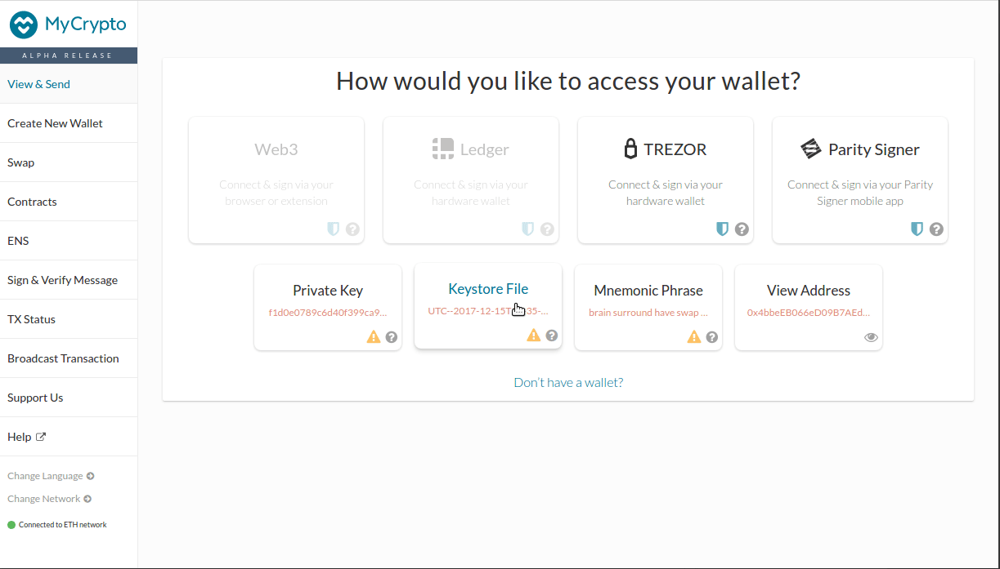

The service [wallet.parity.io](https://wallet.parity.io/) has been deprecated and can not be used anymore. Instead, a page was created to access and download any keystore file (JSON/UTC) used for wallet.parity.io and stored in the browser. This JSON/UTC keystore file is encrypted with a password defined upon account creation. It contains the account private key, it is therefore very important not to transfer it on nontrusted websites. This file, together with the right password, allows accessing an account on Parity client or any compatible 3rd party applications. Below are step by step tutorials to use [MyCrypto Desktop application](#view-and-use-your-account-on-mycrypto-desktop-application), [Metamask](#view-and-use-your-account-on-metamask-beta) or [MyCrypto web application](#view-and-use-your-account-on-mycrypto). If you forgot the password to open an account but have the recovery phrase (given at the account creation), the account recovery is possible using [Parity Ethereum client](Backing-up-&-Restoring).

## View and use your account on MyCrypto Desktop application

- Visit [MyCrypto download page](https://download.mycrypto.com/) and download the application for your platform.
- Make sure to read and understand the warning messages.
- Click on `Keystore File` button.
- Click on `Select wallet file` and select the desired file.
- Enter the password corresponding to this account and click `unlock`.
- You can now see the balance of your account and send Ether from it.

## View and use your account on Metamask beta

Metamask beta allows using an account from a JSON/UTC file. Here is how to proceed:
- If you haven't done so already download [Metamask](https://metamask.io/) on your favourite browser.
- If you haven't any yet, create a dummy account to be able to use the beta version of Metamask.
- In the hamburger menu from the top right corner, select `Try beta!`.
- Using Metamask in full-screen mode is more convenient, click on the arrow icon at the top right to switch to full screen.
- Slick on the account image at the top right and select `Import account`.
- Select type `JSON file`.
- Select the previously downloaded JSON/UTC file and click `Import`.

## View and use your account on MyCrypto

- Visit [MyCrypto](https://mycrypto.com/account) and click on `Keystore File` button.
- Make sure to read and accept the warning then click on `Continue`.
- Click on `Select wallet file` and select the desired file.
- Enter the password corresponding to this account and click `Unlock`.
- You can now see the balance of your account and send Ether from it.

